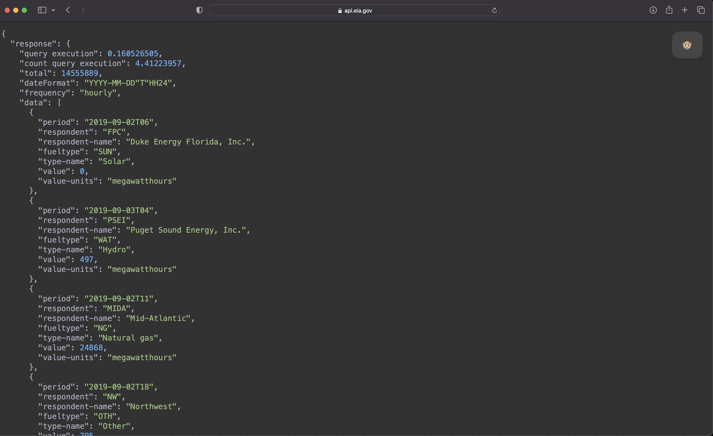

<!-- README.md is generated from README.Rmd. Please edit that file -->

```{r, include = FALSE}
knitr::opts_chunk$set(
  collapse = TRUE,
  comment = "#>",
  fig.path = "man/figures/README-",
  out.width = "100%"
)
```

# EIAapi

<!-- badges: start -->
[](https://cran.r-project.org/package=EIAapi)
[](https://lifecycle.r-lib.org/articles/stages.html#experimental)
[](https://opensource.org/licenses/MIT)
<!-- badges: end -->

WIP - pre-testing.

The **EIAapi** package provides a function to query data from the [EIA API
v2](https://www.eia.gov/opendata/).

## Requirments

To pull data from the API using this package, you will need the following:

-   jq - The package uses [jq](https://stedolan.github.io/jq/) to parse the API output from JSON to tabular format. To download and install jq follow the
instructions on the [download
page](https://stedolan.github.io/jq/download/).
-   API key - To query the EIA API, you will need to register to the
service to receive the API key.

## Installation

Currently, the package is under development and not available on CRAN.
You can install the experiment version from Github:

``` r
# install.packages("devtools")
devtools::install_github("RamiKrispin/tsafr/R/EIAapi")
```

## Examples

A suggested workflow to query data from the EIA API with the `eia_get`
function:

-   Go to the EIA API Dashboard
[website](https://www.eia.gov/opendata/browser)
-   Select the API Route and define filters
-   Submit the query and extract the query information from the query
metadata:
-   API URL
-   Header

[](https://www.eia.gov/opendata/browser/)

In the example above: 

- The API URL: https://api.eia.gov/v2/electricity/rto/fuel-type-data/data/, and
- The query header: 
```JSON
{
"frequency": "hourly",
"data": [
"value"
],
"facets": {},
"start": null,
"end": null,
"sort": [
{
"column": "period",
"direction": "desc"
}
],
"offset": 0,
"length": 5000,
"api-version": "2.0.3"
}
```

Using the URL and header information, we can submit the GET request with the `eia_get` function:

```{r}
library(EIAapi)
library(dplyr)
# Pulling the API key from my renviron file
api_key <- Sys.getenv("eia_key")

df1 <- eia_get(
  api_key = api_key,
  api_url = "https://api.eia.gov/v2/electricity/rto/fuel-type-data/data/",
  data = "value"
)

nrow(df1)

head(df1)
```


A clean format of the query is available on the object attribute:

```{r}
cat(attributes(df1)$query)
```

You can use this query and retrieve the `JSON` object directly from the API to the browser (add your API key):

[](https://api.eia.gov/v2/electricity/rto/fuel-type-data/data?api_key=XXXXX&data[]=value)

**Note:** The API key on the returned object is masked by `XXXXX`. You will have to replace it with your key.

### Adding arguments

The `eia_get` function leverages the [jq](https://stedolan.github.io/jq/) tool to parse the return JSON object from the API into CSV format and the [data.table](https://cran.r-project.org/web/packages/data.table/) package to read and parse the object into R. By default, the function returns a `data.frame` object, but you can use the `format` argument and set the output object as `data.table`:

```{r}
df2 <- eia_get(
  api_key = api_key,
  api_url = "https://api.eia.gov/v2/electricity/rto/fuel-type-data/data/",
  data = "value",
  format = "data.table"
)

df2
```

If you wish to pull more than the `length` upper limit, you can use the `offset` to offset the query by limit and pull the next observations:


```{r}
df3 <- eia_get(
  api_key = api_key,
  api_url = "https://api.eia.gov/v2/electricity/rto/fuel-type-data/data/",
  data = "value",
  length = 5000,
  offset = 5000,
  format = "data.table"
)

df3
```

You can narrow down your pull by using the `facets` argument and applying some filters. For example, in the example above, let's filter data by the `fuletype` field and select energy source as `Natural gas (NG)` and the region as `United States Lower 48 (US48)`, and then extract the header:

``` JSON
{
"frequency": "hourly",
"data": [
"value"
],
"facets": {
"respondent": [
"US48"
],
"fueltype": [
"NG"
]
},
"start": null,
"end": null,
"sort": [
{
"column": "period",
"direction": "desc"
}
],
"offset": 0,
"length": 5000,
"api-version": "2.0.3"
}
```

Updating the query with the `facets` information:

```{r}
facets <- list(respondent = "US48", fueltype = "NG")

df4 <- eia_get(
  api_key = api_key,
  api_url = "https://api.eia.gov/v2/electricity/rto/fuel-type-data/data/",
  data = "value",
  length = 5000,
  format = "data.table",
  facets = facets
)

df4

unique(df4$fueltype)
unique(df4$respondent)
```


Last but not least, you can set the starting and ending time of the query. For example, let's set a window between June 1st and October 1st, 2022:


```{r}
df5 <- eia_get(
  api_key = api_key,
  api_url = "https://api.eia.gov/v2/electricity/rto/fuel-type-data/data/",
  data = "value",
  length = 5000,
  format = "data.table",
  facets = facets,
  start = "2022-06-01T00",
  end = "2022-10-01T00"
)

df5

df5$time <- as.POSIXct(paste(substr(df5$period, start = 1, stop = 10)," ", 
                             substr(df5$period, start = 12, stop = 13), ":00:00", 
                             sep = ""))

plot(x = df5$time, y = df5$value, 
     main = "United States Lower 48 Hourly Electricity Generation by Natural Gas",
     col.main = "#457b9d",
     col = "#073b4c",
     sub = "Source: Form EIA-930 Product: Hourly Electric Grid Monitor",
     xlab = "",
     ylab = "Megawatt Hours",
     cex.main=1, 
     cex.lab=1, 
     cex.sub=0.8,
     frame=FALSE,
     type = "l")
```

### Pulling large dataset

One of the main limitations of the API's main limitations is the number of observation limits as defined by the length argument. Therefore, you will have to iterate the requests to pull a dataset that excised the API number of observations limitation. Here are two simple options to pull datasets beyond the API limitation:

- Use the offset argument
- Split the request by dates/time

The following example demonstrates the second option - splitting the data request by consecutive time windows. The `eia_intervals` function is a helper function that calculates the request dates/time intervals based on start and ends time and the number of rows per request. For example, for the above series, if we want to pull observations between July 1st, 2018, and October 1st 2022, with a limitation of 5000 observations per pull

```{r}
interval <- eia_intervals(start = "2018-07-01T12",
                           end = "2022-10-01T00",
                           length = 5000,
                           tz = "UTC")
interval
```

We can now use the `lapply` function to iterate over the `interval` vector and append it into a single `data.frame object:

```{r}
df6 <- lapply(1:(length(interval) -1), function(i){
  
  s <- as.character(interval[i])

  start <- paste(substr(s, start = 1, stop = 10),
                 "T",
                 substr(s, start = 12, stop = 13),
                 sep = "")

  if(i == length(interval) -1){
    e <- as.character(interval[i + 1])
  } else {
    e <- as.character(interval[i + 1] - lubridate::hours(1))
  }


  end <- paste(substr(e, start = 1, stop = 10),
               "T",
               substr(e, start = 12, stop = 13),
               sep = "")

  df <- eia_get(
    api_key = api_key,
    api_url = "https://api.eia.gov/v2/electricity/rto/fuel-type-data/data/",
    data = "value",
    length = 5000,
    format = "data.frame",
    facets = facets,
    start = start,
    end = end
  )
}) %>% 
  dplyr::bind_rows()

head(df6)

tail(df6)

```

We can now reformat the `period` into `POSIXct` object and plot the data:

```{r}
df6$time <- as.POSIXct(paste(substr(df6$period, start = 1, stop = 10)," ",
                             substr(df6$period, start = 12, stop = 13), ":00:00",
                             sep = ""))

head(df6$time)
```


Before plotting the data, let's calculate the moving average by averaging each observation with the previous and next 12 observations:

``` {r}
df6$mv <- lapply(1:12, function(i){
  d <- NULL
  d <- data.frame(lag = df6$value %>% dplyr::lag(n = i),
             lead = df6$value %>% dplyr::lead(n = i))
  
  names(d) <- c(paste("lag", i, sep = "_"), 
                paste("lead", i, sep = "_"))
  return(d)
}) %>% dplyr::bind_cols(df6$value) %>%
  rowMeans()
```


Last but not least, let's plot the hourly generation and add a smoothed line:

``` {r}
par(mar = c(4, 5, 2, 1), # c(bottom, left, top, right)
    mgp = c(4, 0.5, 0.2), # Dist' plot to label
    las = 1, # Rotate y-axis text
    tck = -.01, # Reduce tick length
    xaxs = "i", yaxs = "i") # Remove plot padding

hourly_color <- rgb(200, 79, 178, alpha = 20, maxColorValue = 255)

plot(
  x = df6$time, y = df6$value, 
  main = "United States Lower 48 Hourly Electricity Generation by Natural Gas",
  col.main = "#457b9d",
  col = hourly_color,
  # sub = "Source: Form EIA-930 Product: Hourly Electric Grid Monitor",
  xlab = "Source: Form EIA-930 Product: Hourly Electric Grid Monitor",
  ylab = "Megawatt Hours",
  # axes = FALSE, # Don't plot the axes
  frame.plot = FALSE, 
  cex.main=1, 
  cex.lab=1, 
  cex.sub=0.8,
  xlim = c(min(df6$time), max(df6$time)), 
  ylim = c(70000, 350000),
  panel.first = abline(h = seq(100000, 350000, 50000), col = "grey80"),
  # frame=FALSE,
  pch = 21,
  type = "p"
)

lines(x = df6$time, y = df6$mv, col = "black", lwd = 0.6)

```

Resources I used to create the plots with base R graphics:

- Jumping Rivers blog post - https://www.jumpingrivers.com/blog/styling-base-r-graphics/
- Introduction to Data Science by Hansjörg Neth - https://intro2r.com/simple-base-r-plots.html#scatterplot
