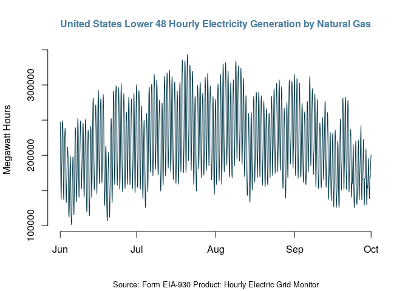

<!-- README.md is generated from README.Rmd. Please edit that file -->

# EIAapi

<!-- badges: start -->

[](https://cran.r-project.org/package=EIAapi)
[](https://lifecycle.r-lib.org/articles/stages.html#experimental)
[](https://opensource.org/license/mit/)
<!-- badges: end -->

The **EIAapi** package provides a function to query data from the [EIA
API v2](https://www.eia.gov/opendata/).

## Requirments

To pull data from the API using this package, you will need the
following:

-   jq - The package uses [jq](https://stedolan.github.io/jq/) to parse
    the API output from JSON to tabular format. To download and install
    jq follow the instructions on the [download
    page](https://stedolan.github.io/jq/download/).
-   API key - To query the EIA API, you will need to register to the
    service to receive the API key.

## Installation

Currently, the package is under development and not available on CRAN.
You can install the experiment version from Github:

``` r
# install.packages("devtools")
devtools::install_github("RamiKrispin/tsafr/R/EIAapi")
```

## Query data

A suggested workflow to query data from the EIA API with the `eia_get`
function:

-   Go to the EIA API Dashboard
    [website](https://www.eia.gov/opendata/browser)
-   Select the API Route and define filters
-   Submit the query and extract the query information from the query
    metadata:
    -   API URL
    -   Header

[](https://www.eia.gov/opendata/browser/)

In the example above:

-   The API URL:
    `https://api.eia.gov/v2/electricity/rto/fuel-type-data/data/`, and
-   The query header:

``` json
{
    "frequency": "hourly",
    "data": [
        "value"
    ],
    "facets": {},
    "start": null,
    "end": null,
    "sort": [
        {
            "column": "period",
            "direction": "desc"
        }
    ],
    "offset": 0,
    "length": 5000,
    "api-version": "2.0.3"
}
```

Using the URL and header information, we can submit the GET request with
the `eia_get` function:

``` r
library(EIAapi)

# Pulling the API key from my renviron file
api_key <- Sys.getenv("eia_key")

df1 <- eia_get(
  api_key = api_key,
  api_url = "https://api.eia.gov/v2/electricity/rto/fuel-type-data/data/",
  data = "value"
)

nrow(df1)
#> [1] 5000

head(df1)
#>          period respondent                       respondent-name fueltype
#> 1 2019-09-02T06        FPC             Duke Energy Florida, Inc.      SUN
#> 2 2019-09-03T04       PSEI              Puget Sound Energy, Inc.      WAT
#> 3 2019-09-02T11       MIDA                          Mid-Atlantic       NG
#> 4 2019-09-02T18         NW                             Northwest      OTH
#> 5 2019-09-02T21       AECI Associated Electric Cooperative, Inc.       NG
#> 6 2019-09-02T12       CENT                               Central      NUC
#>     type-name value   value-units
#> 1       Solar     0 megawatthours
#> 2       Hydro   497 megawatthours
#> 3 Natural gas 24868 megawatthours
#> 4       Other   795 megawatthours
#> 5 Natural gas  1551 megawatthours
#> 6     Nuclear  2001 megawatthours
```

The `eia_get` function leverages the
[jq](https://stedolan.github.io/jq/) tool to parse the return JSON
object from the API into CSV format and the
[data.table](https://CRAN.R-project.org/package=data.table) package to
read and parse the object into R. By default, the function returns a
`data.frame` object, but you can use the `format` argument and set the
output object as `data.table`:

``` r
df2 <- eia_get(
  api_key = api_key,
  api_url = "https://api.eia.gov/v2/electricity/rto/fuel-type-data/data/",
  data = "value",
  format = "data.table"
)

df2
#>              period respondent                         respondent-name fueltype
#>    1: 2019-09-02T06        FPC               Duke Energy Florida, Inc.      SUN
#>    2: 2019-09-03T04       PSEI                Puget Sound Energy, Inc.      WAT
#>    3: 2019-09-02T11       MIDA                            Mid-Atlantic       NG
#>    4: 2019-09-02T18         NW                               Northwest      OTH
#>    5: 2019-09-02T21       AECI   Associated Electric Cooperative, Inc.       NG
#>   ---                                                                          
#> 4996: 2019-09-01T15        HST                       City of Homestead       NG
#> 4997: 2019-09-01T18        AEC           PowerSouth Energy Cooperative      WAT
#> 4998: 2019-09-01T17         SC South Carolina Public Service Authority       NG
#> 4999: 2019-09-02T04       PSEI                Puget Sound Energy, Inc.      WND
#> 5000: 2019-09-01T05        FPC               Duke Energy Florida, Inc.      OIL
#>         type-name value   value-units
#>    1:       Solar     0 megawatthours
#>    2:       Hydro   497 megawatthours
#>    3: Natural gas 24868 megawatthours
#>    4:       Other   795 megawatthours
#>    5: Natural gas  1551 megawatthours
#>   ---                                
#> 4996: Natural gas     0 megawatthours
#> 4997:       Hydro     0 megawatthours
#> 4998: Natural gas   780 megawatthours
#> 4999:        Wind   239 megawatthours
#> 5000:   Petroleum     0 megawatthours
```

If you wish to pull more than the `length` upper limit, you can use the
`offset` to offset the query by limit and pull the next observations:

``` r
df3 <- eia_get(
  api_key = api_key,
  api_url = "https://api.eia.gov/v2/electricity/rto/fuel-type-data/data/",
  data = "value",
  length = 5000,
  offset = 5000,
  format = "data.table"
)

df3
#>              period respondent                                respondent-name
#>    1: 2019-09-01T10        TAL                            City of Tallahassee
#>    2: 2019-09-01T23         SE                                      Southeast
#>    3: 2019-09-01T16       SWPP                           Southwest Power Pool
#>    4: 2019-09-01T09       PSCO             Public Service Company of Colorado
#>    5: 2019-09-01T23       CPLW                      Duke Energy Progress West
#>   ---                                                                        
#> 4996: 2019-09-08T13       SCEG           Dominion Energy South Carolina, Inc.
#> 4997: 2019-09-09T02         SC        South Carolina Public Service Authority
#> 4998: 2019-09-09T03        YAD Alcoa Power Generating, Inc. - Yadkin Division
#> 4999: 2019-09-08T17       TIDC                    Turlock Irrigation District
#> 5000: 2019-09-09T00         SE                                      Southeast
#>       fueltype   type-name value   value-units
#>    1:       NG Natural gas   277 megawatthours
#>    2:       NG Natural gas 21452 megawatthours
#>    3:      COL        Coal 13539 megawatthours
#>    4:      COL        Coal  1835 megawatthours
#>    5:      WAT       Hydro    32 megawatthours
#>   ---                                         
#> 4996:      WAT       Hydro    15 megawatthours
#> 4997:      SUN       Solar     2 megawatthours
#> 4998:      WAT       Hydro     1 megawatthours
#> 4999:       NG Natural gas   193 megawatthours
#> 5000:      OIL   Petroleum     0 megawatthours
```

You can narrow down your pull by using the `facets` argument and
applying some filters. For example, in the example above, let’s filter
data by the `fuletype` field and select energy source as
`Natural gas (NG)` and the region as `United States Lower 48 (US48)`,
and then extract the header:

``` json
{
    "frequency": "hourly",
    "data": [
        "value"
    ],
    "facets": {
        "respondent": [
            "US48"
        ],
        "fueltype": [
            "NG"
        ]
    },
    "start": null,
    "end": null,
    "sort": [
        {
            "column": "period",
            "direction": "desc"
        }
    ],
    "offset": 0,
    "length": 5000,
    "api-version": "2.0.3"
}
```

Updating the query with the `facets` information:

``` r
facets <- list(respondent = "US48", fueltype = "NG")

df4 <- eia_get(
  api_key = api_key,
  api_url = "https://api.eia.gov/v2/electricity/rto/fuel-type-data/data/",
  data = "value",
  length = 5000,
  format = "data.table",
  facets = facets
)

df4
#>              period respondent        respondent-name fueltype   type-name
#>    1: 2019-09-03T02       US48 United States Lower 48       NG Natural gas
#>    2: 2019-09-02T08       US48 United States Lower 48       NG Natural gas
#>    3: 2019-09-02T06       US48 United States Lower 48       NG Natural gas
#>    4: 2019-09-03T03       US48 United States Lower 48       NG Natural gas
#>    5: 2019-09-02T16       US48 United States Lower 48       NG Natural gas
#>   ---                                                                     
#> 4996: 2018-11-09T20       US48 United States Lower 48       NG Natural gas
#> 4997: 2018-11-09T21       US48 United States Lower 48       NG Natural gas
#> 4998: 2018-11-07T11       US48 United States Lower 48       NG Natural gas
#> 4999: 2018-11-07T12       US48 United States Lower 48       NG Natural gas
#> 5000: 2018-11-07T13       US48 United States Lower 48       NG Natural gas
#>        value   value-units
#>    1: 238622 megawatthours
#>    2: 149180 megawatthours
#>    3: 164671 megawatthours
#>    4: 217190 megawatthours
#>    5: 206225 megawatthours
#>   ---                     
#> 4996: 145412 megawatthours
#> 4997: 147572 megawatthours
#> 4998: 109269 megawatthours
#> 4999: 123157 megawatthours
#> 5000: 132755 megawatthours

unique(df4$fueltype)
#> [1] "NG"
unique(df4$respondent)
#> [1] "US48"
```

Last but not least, you can set the starting and ending time of the
query. For example, let’s set a window between June 1st and October 1st,
2022:

``` r
df5 <- eia_get(
  api_key = api_key,
  api_url = "https://api.eia.gov/v2/electricity/rto/fuel-type-data/data/",
  data = "value",
  length = 5000,
  format = "data.table",
  facets = facets,
  start = "2022-06-01T00",
  end = "2022-10-01T00"
)

df5
#>              period respondent        respondent-name fueltype   type-name
#>    1: 2022-06-01T00       US48 United States Lower 48       NG Natural gas
#>    2: 2022-06-01T01       US48 United States Lower 48       NG Natural gas
#>    3: 2022-06-01T02       US48 United States Lower 48       NG Natural gas
#>    4: 2022-06-01T03       US48 United States Lower 48       NG Natural gas
#>    5: 2022-06-01T04       US48 United States Lower 48       NG Natural gas
#>   ---                                                                     
#> 2925: 2022-09-30T20       US48 United States Lower 48       NG Natural gas
#> 2926: 2022-09-30T21       US48 United States Lower 48       NG Natural gas
#> 2927: 2022-09-30T22       US48 United States Lower 48       NG Natural gas
#> 2928: 2022-09-30T23       US48 United States Lower 48       NG Natural gas
#> 2929: 2022-10-01T00       US48 United States Lower 48       NG Natural gas
#>        value   value-units
#>    1: 247460 megawatthours
#>    2: 242340 megawatthours
#>    3: 233394 megawatthours
#>    4: 215728 megawatthours
#>    5: 183732 megawatthours
#>   ---                     
#> 2925: 186416 megawatthours
#> 2926: 190630 megawatthours
#> 2927: 196122 megawatthours
#> 2928: 198929 megawatthours
#> 2929: 200809 megawatthours

df5$time <- as.POSIXct(paste(substr(df5$period, start = 1, stop = 10)," ", 
                       substr(df5$period, start = 12, stop = 13), ":00:00", 
                       sep = ""))

plot(x = df5$time, y = df5$value, 
     main = "United States Lower 48 Hourly Electricity Generation by Natural Gas",
     col.main = "#457b9d",
     col = "#073b4c",
     sub = "Source: Form EIA-930 Product: Hourly Electric Grid Monitor",
     xlab = "",
     ylab = "Megawatt Hours",
     cex.main=1, 
     cex.lab=1, 
     cex.sub=0.8,
     frame=FALSE,
     type = "l")
```



## API Resources

-   EIA API documentation:
    <https://www.eia.gov/opendata/documentation.php>
-   EIA APIv2 Webinar:
    <https://www.youtube.com/watch?v=1VsSp1XG-Pg&t=1671s&ab_channel=EIAgov>
