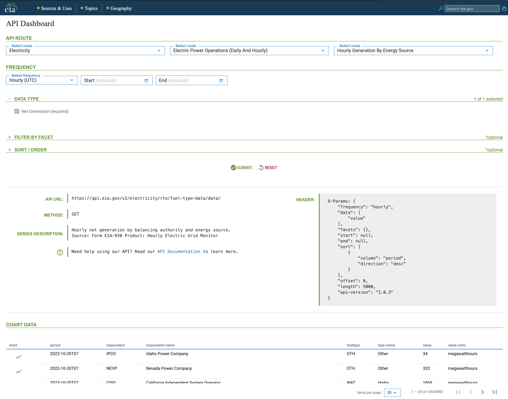

<!-- README.md is generated from README.Rmd. Please edit that file -->

# EIAapi

<!-- badges: start -->
<!-- badges: end -->

WIP - pre-testing and spell checks

The **EIAapi** package provides function to query data from the [EIA API
v2](https://www.eia.gov/opendata/).

## Requirments

To pull data from the API using this package you will need:

-   jq - The package uses on the back-end
    [jq](https://stedolan.github.io/jq/) to parse the API output from
    JSON to tabular format. To download and install jq follow the
    instructions on the [download
    page](https://stedolan.github.io/jq/download/).
-   API key - To query the EIA API, you will need to register to the
    service to receive API key.

## Installation

Currently, the package is under development and not available on CRAN.
You can install the experiment version from Github:

``` r
# install.packages("devtools")
devtools::install_github("RamiKrispin/tsafr/R/EIAapi")
```

## Query data

A suggested workflow to query data from the EIA API with the `eia_get`
function:

-   Go to the EIA API Dashboard
    [website](https://www.eia.gov/opendata/browser)
-   Select the API Route and define filters
-   Submit the query and extract the query information from the query
    metadata:
    -   API URL

    -   Header

[](https://www.eia.gov/opendata/browser/)

In the example above:

-   The API URL:
    <https://api.eia.gov/v2/electricity/rto/fuel-type-data/data/>
-   Query header:

``` json
{
    "frequency": "hourly",
    "data": [
        "value"
    ],
    "facets": {},
    "start": null,
    "end": null,
    "sort": [
        {
            "column": "period",
            "direction": "desc"
        }
    ],
    "offset": 0,
    "length": 5000,
    "api-version": "2.0.3"
}
```

Using the URL and header information we can submit the GET request with
the `eia_get` function:

``` r
# Pulling the API key from my renviron file
# api_key <- Sys.getenv("eia_key")
# 
# df <- eia_get(
#   api_key = api_key,
#   api_url = "https://api.eia.gov/v2/electricity/rto/fuel-type-data/data/"
# )
```
