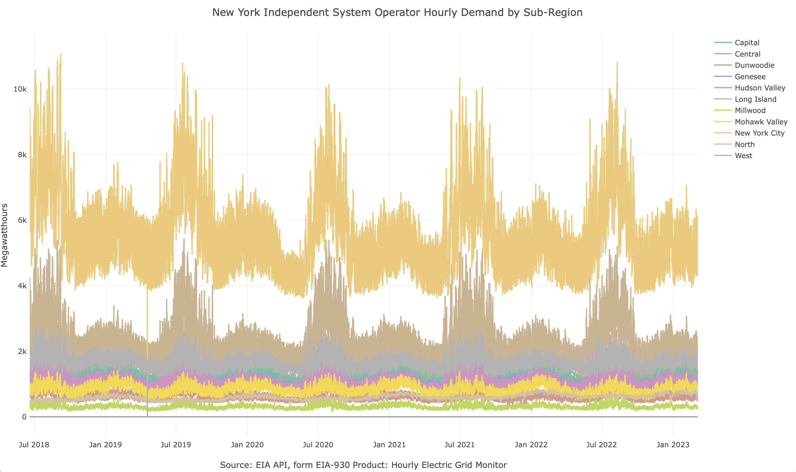

<!-- README.md is generated from README.Rmd. Please edit that file -->

```{r, include = FALSE}
knitr::opts_chunk$set(
  collapse = TRUE,
  comment = "#>",
  fig.path = "man/figures/README-",
  out.width = "100%"
)
```

# atsafdata 

⚠️WIP⚠️

<!-- badges: start -->
<!-- badges: end -->

The **atsafdata** package provides examples of regular time series for the book [Applied Time Series Analysis and Forecasting with R](https://github.com/RamiKrispin/atsaf). That includes the following series:

- `nyis` - The New York Independent System Operator hourly demand by sub-region (11 series)
- `sfo` - ⚠️WIP⚠️ Summary statistics of the monthly passengers and landing in San Francisco International Airport (SFO)
- `usgas` - ⚠️WIP⚠️ The monthly demand for natural gas in the US 

## Installation

Currently the package is not available on CRAN, and you can be install the development version of atsafdata from [GitHub](https://github.com/RamiKrispin/atsaf/R/atsafdata):

``` r
# install.packages("devtools")
devtools::install_github("https://github.com/RamiKrispin/atsaf/R/atsafdata")
```

## Examples

The `nyis` dataset contains 11 regular time series, representing the hourly demand for electricity by the New York Independent System Operator (NYIS) balancing authority. Each series represents the demand in a sub-region of the NYIS balancing authority. Let's load and plot the data:

```{r load}
library(atsafdata)

data(nyis)

head(nyis)
```

The `subregiong` and `subregion_name` fields represent the sub-region code and name, respectively:

```{r subregions}
unique(nyis$subregion_name)
```

Plotting the hourly demand for electricyt by sub-region using plotly:

```r
library(plotly)

plot_ly(data = nyis,
        x = ~ time,
        y = ~ value,
        color = ~ subregion_name,
        type = "scatter",
        mode = "line") |>
  layout(title = "New York Independent System Operator Hourly Demand by Sub-Region",
         yaxis = list(title = "Megawatthours"),
         xaxis = list(title = "Source: EIA API, form EIA-930 Product: Hourly Electric Grid Monitor"), 
         margin = list(l = 50, r = 50, b = 60, t = 60, pad = 4))
```

```{r include=FALSE}
#library(plotly)

# p <- plot_ly()
# 
# orca(p, "man/figures/nyis.svg")
```


